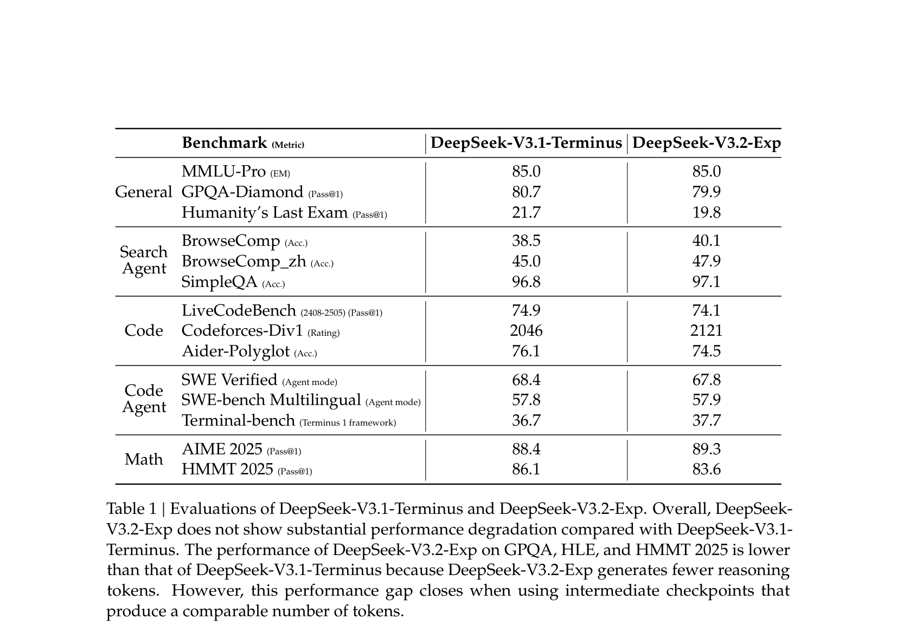
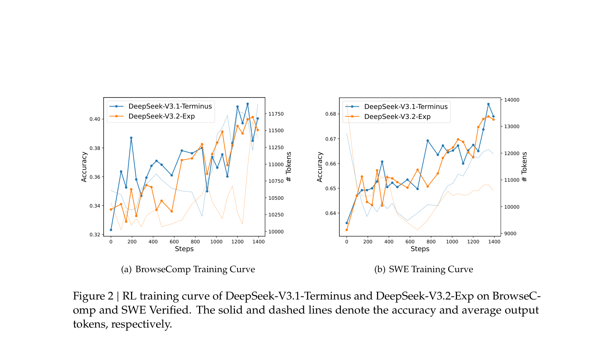
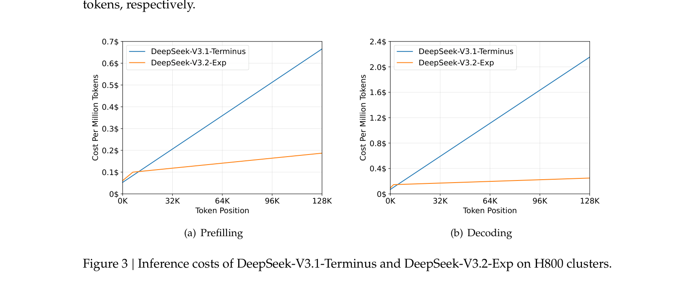
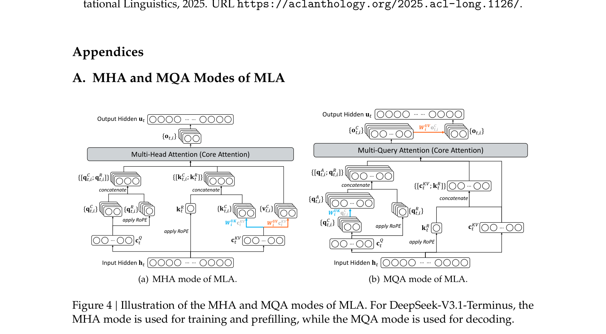

# DeepReading

AI-powered academic paper reading assistant. Upload a PDF, get a structured reading report with precise, clickable citations that jump to the exact location in the original PDF.

## Features

- **Structured Report** — Generates TLDR, Motivation, Method, Experiments, Conclusion
- **Precise Citations** — Click any citation to jump to the exact position in the PDF and highlight the source text
- **LLM Tool Calling** — LLM calls PDF analysis tools during generation to understand paper structure and verify facts
- **Figure Extraction** — Automatically detects and crops figures/tables from the PDF
- **Multi-Language** — English or Chinese reports
- **Split View** — Report on the left, PDF on the right

## Demo

> Paper: **DeepSeek-V3.2-Exp: Boosting Long-Context Efficiency with DeepSeek Sparse Attention** (6 pages, 5 figures)

**TLDR** — DeepSeek-V3.2-Exp 是一个实验性的稀疏注意力模型，通过继续训练为 DeepSeek-V3.1-Terminus 引入了 DeepSeek Sparse Attention (DSA)。`[p.1]` DSA 通过闪电索引器和细粒度令牌选择机制，在长上下文场景中显著提升了训练和推理效率。`[p.1]`

Each `[p.N]` citation is clickable — it opens the PDF viewer, scrolls to the exact y-position, and highlights the quoted text:

```
[[p.4:841 "DSA achieves a significant end-to-end speedup in long-context scenarios"]]
       │  │                              └── verbatim quote from the paper
       │  └── y-position (0-1000 scale, precise vertical location)
       └── page number
```

<details>
<summary><b>Full generated report (click to expand)</b></summary>

---

## TLDR

DeepSeek-V3.2-Exp 是一个实验性的稀疏注意力模型，通过继续训练为 DeepSeek-V3.1-Terminus 引入了 DeepSeek Sparse Attention (DSA)。DSA 通过闪电索引器和细粒度令牌选择机制，在长上下文场景中显著提升了训练和推理效率。

## Motivation

现有的 Transformer 模型在处理长序列时面临二次方注意力复杂度的挑战，这限制了模型在长上下文场景下的效率。

为了解决这一问题，DeepSeek-AI 提出了 DeepSeek-V3.2-Exp，旨在通过稀疏注意力机制显著提升长上下文处理的效率，同时保持与原始模型相当的性能水平。

## Method

### 架构设计

与 DeepSeek-V3.1-Terminus 相比，DeepSeek-V3.2-Exp 的唯一架构修改是通过继续训练引入了 DeepSeek Sparse Attention (DSA)。

DSA 原型主要由两个组件组成：闪电索引器和细粒度令牌选择机制。闪电索引器计算查询令牌 hₜ 与前一个令牌 hₛ 之间的索引分数 Iₜ,ₛ，确定哪些令牌将被查询令牌选择。给定每个查询令牌 hₜ 的索引分数，细粒度令牌选择机制仅检索与 top-k 索引分数对应的键值条目。

### 在 MLA 下实例化 DSA

考虑到从 DeepSeek-V3.1-Terminus 继续训练的需求，我们基于 MLA 的 MQA 模式实现了 DSA，其中每个潜在向量将在查询令牌的所有查询头之间共享。


### 训练流程

从 DeepSeek-V3.1-Terminus 的基础检查点开始，继续预训练包括两个阶段：

- **密集预热阶段**：保持密集注意力，冻结除闪电索引器外的所有参数
- **稀疏训练阶段**：引入细粒度令牌选择机制，优化所有参数以适应 DSA 的稀疏模式

后训练阶段也采用与稀疏继续预训练阶段相同的方式使用稀疏注意力。

## Experiments

### 模型能力评估

在多个基准测试上评估 DeepSeek-V3.2-Exp，未观察到与 DeepSeek-V3.1-Terminus 相比在短/长上下文任务上出现显著的性能下降。



两个模型在 BrowseComp 和 SWE Verified 上的性能在整个训练过程中稳步提高，曲线紧密对齐，反映了 DSA 的训练稳定性。



### 推理成本分析

DSA 将核心注意力复杂度从 O(L²) 降低到 O(Lk)，在长上下文场景中实现了显著的端到端加速。



### MLA 模式说明

MHA 模式用于训练和预填充，MQA 模式用于解码。



## Conclusion

DeepSeek-V3.2-Exp 在保持与 DeepSeek-V3.1-Terminus 相当性能的同时，显著提升了长上下文场景下的计算效率。团队仍在积极寻求在真实世界场景中进行进一步的大规模测试，以发现稀疏注意力架构的潜在限制。

---

</details>

## Quick Start

```bash
# Install
pip install -r requirements.txt

# Configure API key
echo "LLM_API_KEY=your-api-key-here" > .env

# Run
python app.py
```

Open `http://localhost:8000`, upload a PDF, click **Generate Report**.

## Configuration

Set `LLM_API_KEY` in `.env`. To switch LLM provider, edit `base_url` and `MODEL` in `llm_service.py`.
