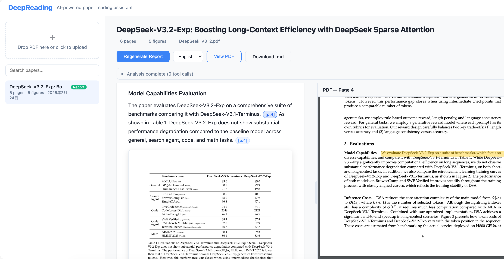

# DeepReading

AI-powered academic paper reading assistant. Upload a PDF or paste a URL, get a structured reading report with precise, clickable citations that jump to the exact location in the original document.

## Features

- **Structured Report** — Generates TLDR, Motivation, Method, Experiments, Conclusion
- **Precise Citations** — Click any citation to jump to the exact position in the PDF/HTML and highlight the source text
- **LLM Tool Calling** — LLM calls PDF analysis tools during generation to understand paper structure and verify facts
- **Auto-generated Diagrams** — LLM writes HTML/SVG code to create explanatory diagrams, reviewed by a vision model
- **Figure Extraction** — Vision LLM scans PDF pages to detect and crop figures/tables with descriptions
- **Discussion & Polish** — Automatic Q&A rounds between a "reader" and "writer" agent, then polishes the report
- **URL Support** — Paste a URL to read HTML articles (WeChat, Zhihu, arXiv HTML, etc.) or remote PDFs
- **Multi-Language** — English or Chinese reports
- **Split View** — Report on the left, PDF/HTML on the right

## Demo



## Quick Start

```bash
pip install -r requirements.txt

# Set your API key (defaults to DeepSeek)
echo 'LLM_API_KEY=sk-xxx' > .env

python app.py
```

Open `http://localhost:8000`, upload a PDF or paste a URL, click **Generate Report**.

## Configuration

All LLM settings are in `.env` and `config.py`. Defaults point to DeepSeek, so only the API key is required:

```bash
# .env — minimum required
LLM_API_KEY=sk-xxx

# Optional: override defaults
LLM_API_BASE=https://api.deepseek.com    # OpenAI-compatible endpoint (default: DeepSeek)
LLM_MODEL=deepseek-chat                   # main model (default: deepseek-chat)
REPORT_MODEL=deepseek-reasoner            # model for report generation (default: LLM_MODEL)
VISION_MODEL=deepseek-chat                # model for figure extraction & review (default: LLM_MODEL)
LLM_API_VERSION=                          # set this to use Azure OpenAI
```

**Want to use a different LLM provider?** See [docs/llm-adaptation.md](docs/llm-adaptation.md) for a guide.

## Project Structure

```
DeepReading/
├── app.py                  # FastAPI entry point
├── config.py               # Centralized configuration
├── llm_client.py           # Unified LLM interface (2 public functions)
│                           #   generate_stream() — report / discussion / polish
│                           #   generate_sync()   — figure extraction / review
├── requirements.txt
├── core/
│   ├── database.py         # SQLite persistence
│   └── llm_service.py      # Report & discussion generation orchestration
├── tools/
│   ├── pdf_tools.py        # PDF analysis tools (structure, search, quotes)
│   ├── html_tools.py       # HTML analysis tools (same interface as PDF)
│   ├── code_executor.py    # HTML/SVG → PNG diagram renderer
│   └── figure_reviewer.py  # Vision-based figure quality check
├── processor/
│   ├── pdf_processor.py    # PDF → text + figures
│   ├── html_processor.py   # URL/HTML → text + figures
│   └── vision_extractor.py # Vision LLM figure detection
├── static/
│   └── index.html          # Frontend SPA
└── docs/
    └── llm-adaptation.md   # Guide: adapt to your own LLM
```

## How It Works

1. **Upload** — PDF is parsed (PyMuPDF), text extracted with page markers, figures detected by vision LLM
2. **Tool-calling Loop** — LLM reads paper structure, examines pages, searches text, then writes the report with citations
3. **Diagram Generation** — LLM writes HTML/SVG code, rendered to PNG via Playwright, quality-checked by a vision model
4. **Citation Enhancement** — Post-processing adds precise y-positions to citations for accurate scroll-to-source
5. **Discussion & Polish** — 3 rounds of reader questions + writer answers, then a polished final report

## License

Apache 2.0
